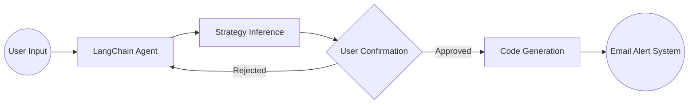

# Trading Agent System Design

## Overview

This document outlines the architecture and implementation approach for our LangChain-based trading signal system. The system is designed to process user trading strategies, validate them, generate monitoring code, and provide automated alerts.

## System Architecture

## Component Analysis

### 1. Core Components

- LangChain-based agent system
- User input processing module
- Stock data monitoring system
- Email notification system
- Strategy validation module
- Code generation capabilities

### 2. Implementation Considerations

#### User Input Processing

- LangChain prompt templates for structured conversation
- Trading terminology understanding
- OpenAI function calling for structured data extraction

#### Strategy Inference

- Technical indicator mapping
- Pattern recognition:
  - Moving Averages
  - RSI
  - MACD
  - Volume analysis
- Support for both technical and fundamental analysis

#### Code Generation

- Integration with existing stock data fetching
- Efficient monitoring code generation
- Documentation generation for user understanding

#### Monitoring System

- Continuous vs scheduled monitoring decisions
- Rate limit handling
- Market hours consideration

## Potential Challenges

1. **Strategy Ambiguity**

   - Handling unclear user inputs
   - Strategy validation accuracy

2. **Technical Limitations**
   - Real-time data reliability
   - False signals handling
   - Email delivery reliability

## Integration Points

### Current Codebase Integration

- Extension of getData.py functionality
- Frontend component additions
- Email system integration

## Next Steps

1. Initial Setup

   - LangChain agent configuration
   - Basic strategy templates

2. Core Development

   - Strategy inference system
   - Validation loop implementation
   - Monitoring system development

3. Enhancement Phase
   - Email notification system
   - Testing framework
   - User feedback integration

## Development Priorities

1. Basic LangChain agent structure
2. Strategy inference system
3. Data collection system enhancement

This document will be updated as the system evolves and new requirements are identified.
