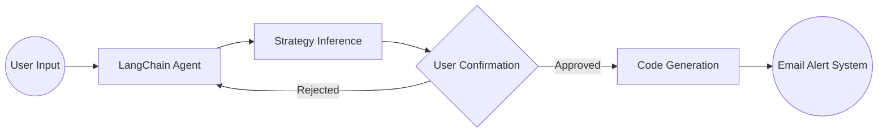

# 🤖 AI Trading Agent

An intelligent trading assistant that helps you monitor stocks and execute trading strategies using natural language processing and technical analysis.

## 🌟 Features

- 📈 Real-time stock monitoring
- 🤖 Natural language processing for strategy creation
- 📊 Technical analysis with multiple indicators
- ⚡ Automated trading signals
- 📧 Email alerts for trading opportunities
- 🔍 Strategy validation and optimization

## 🚀 Getting Started

### Prerequisites

- Python 3.8+
- pip
- TA-Lib

### Installation

1. Clone the repository

```bash
git clone https://github.com/yourusername/2025agentTrader.git
cd 2025agentTrader
```

2. Install TA-Lib (required for technical analysis)

macOS:

```bash
brew install ta-lib
```

Linux:

```bash
wget http://prdownloads.sourceforge.net/ta-lib/ta-lib-0.4.0-src.tar.gz
tar -xzf ta-lib-0.4.0-src.tar.gz
cd ta-lib/
./configure --prefix=/usr
make
sudo make install
```

Windows:
Download and install from: https://www.lfd.uci.edu/~gohlke/pythonlibs/#ta-lib

3. Install Python dependencies

```bash
pip install -r requirements.txt
```

4. Set up environment variables

```bash
cp .env.example .env
```

Edit `.env` and add your OpenAI API key.

## 💡 Usage

### Basic Example

```python
from agents.trading_agent import TradingAgent

# Initialize the agent
agent = TradingAgent()

# Process a trading strategy
response = agent.process_user_input(
    "Track NVIDIA stock and alert me when RSI goes below 30"
)
print(response)
```

### Sample Strategies

1. RSI-based oversold alert:

```python
strategy = {
    "ticker": "NVDA",
    "indicator": "RSI",
    "condition": "below",
    "threshold": 30
}
```

2. Volume spike detection:

```python
strategy = {
    "ticker": "AAPL",
    "indicator": "Volume",
    "condition": "above",
    "threshold": "1.5x_average"
}
```

## 🛠️ Architecture



## 📚 Documentation

- [System Design](./Docs/system_design.md)
- [API Reference](./Docs/api_reference.md)
- [Strategy Guide](./Docs/strategy_guide.md)

## 🤝 Contributing

Contributions are welcome! Please feel free to submit a Pull Request.

## 📝 License

This project is licensed under the MIT License - see the [LICENSE](LICENSE) file for details.

## ⚠️ Disclaimer

This software is for educational purposes only. Do not use it for actual trading without proper validation and risk assessment.
